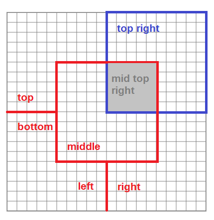
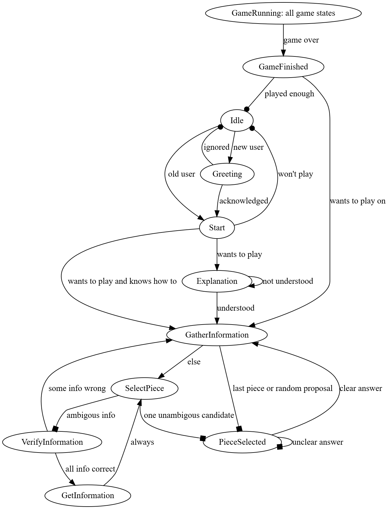

This project was written and tested on Windows 10. The Kotlin version used on both operating systems was 1.3.70

## Name
main.kt - Implements a user-robot dialog interaction in a pentomino game setting.

## Adjust Code to Experimental Settings
At the top of the interaction.kt file one can find three variables x, y, z that
define the position of the tablet in relation to the furhat robot. The default
setting assumes that the tablet lies in the robot's line of sight on the same
plattform as the robot with a distance of 1 meter.  
**If real experimental conditions drastically differ from this default setting,
it might become necessary to adapt those parameters.**

## Description
Our furhat robot Proto employs predefined gestures together with 7 custom gestures,
2 custom speech sounds and 1 custom speech style. The robot evenly gives attention
to the user and the board, guiding the users gaze to the board when appropriate.  
A large inventory of possible color terms guarantees freedom in the user's word choice.
For example, the purple piece could also be addressed with *lilac*, *violet*,
*lavender*, *mauve* or *orchid*. We recommend the choice of *violet* because it is almost
always correctly picked up by the speech recognizer. As we are aware of the high degree
of similarity  between groups of colors, we introduced an abstract color category that
e. g. would group light red, pink and purple together. If an exact color does not match,
Proto falls back on this abstract category.

## Positions

## State Graph
Legend - Arrow Heads:
+ box: enter state while attending the board
+ arrow: enter state while attending the user
+ circle: enter state while attending nobody

## Example Sentences
+ `Next, take the neon cup at the bottom of the board`
  [light green][U][at the bottom]
+ `The piece at the bottom left.`   
  [][][at the bottom left]
+ `Please pick up the pink piece that looks like a cross.`  
  [pink][X][]
+ `Choose the piece in the top right middle.`  
  [][][in the top right middle]
+ `Choose the hazelnut colored piece.`  
  [beige][][]

## Known Trouble Spots
It is recommended not to talk in first person singular to the robot. Phrases like `I'd like to select ...` will
lead the robot to think that you are interested in placing the I-shaped piece.
For very specific information of the pattern `in the bottom left middle` the robot will rephrase those as only `in the middle`
if it tells you about what it understood. Don't be confused by this, internally it remembers the exact position.

## Authors
Wencke Liermann, Lisa Plagemann, Niklas Stepczynski  
University of Potsdam  
Computational Linguistics 5. Semester  
Wise20/21  

For further inquiries and feedback, please contact: wliermann@uni-potsdam.de