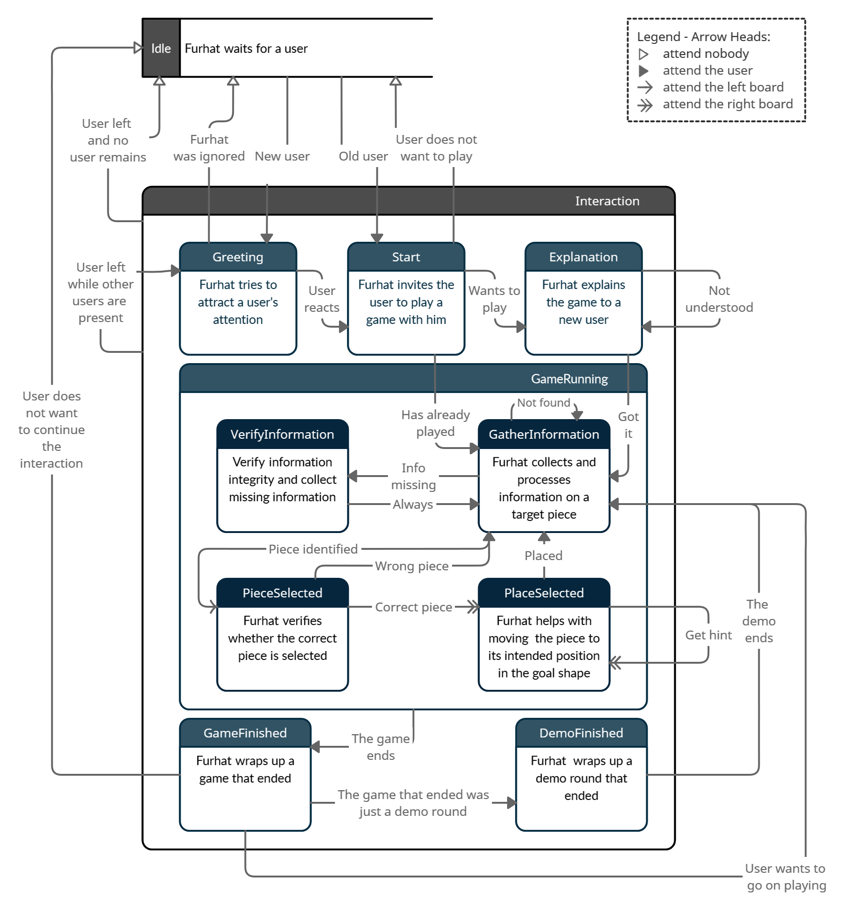

This project was written and tested in the following environment:  
OS: Windows 10  
Kotlin: 1.3.70.  
Furhat SDK: 1.24.0  
  
Be aware that for the new Kotlin release 1.5.0 you may encounter
an error of the form:
```
IntentInstance' can't be called in this context by implicit receiver. Use the explicit one if necessary
```
However, to our knowledge this error does not negatively affect the 
functionality of the program.

## Name
main.kt - Implements a user-robot dialog interaction in a Pentomino game setting.

## Description
In the experiment, you will meet the robot *Proto*. *Proto* will invite you to play a game with him.
Please agree to his offer and listen to his explanations carefully. Please make sure to speak loudly and clearly
during the game!  
You can find additional details on our dialog model and the objectives we seeked to achieve in the documentation paper.

## Requirements

You need to have **npm** and **node** installed. Other prerequisites are a running **Kotlin** and **Furhat SDK**, preferably the versions mentioned above.

## Build the Pentomino Game

 1. Open a terminal of your choice
 2. cd into the relevant directory `cd PentominoWithFurhat/assets/pentomino`
 3. `npm install` to install all standard libraries.
    Obviously, this step has to be executed only once and not every time you change something on the project.
 4. `npm run build` to build the Pentomino game

If you did everything correctly, you should see two folder, namely `node_modules` and `dist` in the directory `PentominoWithFurhat/assets/pentomino`.


## Adjust Code to Experimental Settings
At the top of the *gameRunning.kt* file one can find three variables x, y, z that define the position of the tablet in relation to the furhat robot.
The default setting assumes that the tablet lies in the robot's line of sight on the same plattform as the robot with a distance of 0.45 meter.  
**If real experimental conditions drastically differ from this default setting, it might become necessary to adapt those parameters.**


## State Graph



## Example Sentences
### Selection
+ Next, take the neon cup at the bottom of the board.  
  `[light green][U][at the bottom]`
+ I want you to pick up the piece at the bottom left.    
  `[][][at the bottom left]`
+ Please pick up the pink piece that looks like a cross.  
  `[pink][X][]`
+ Choose the piece in the top right middle.  
  `[][][in the top right middle]`
+ Could you get me the hazelnut colored piece?  
  `[beige][][]`
  
You can observe the selection process in action [here](https://www.ling.uni-potsdam.de/science-day/). 

### Placement
+ I want you to flip the piece horizontally.  
`[Mirror][horizontal]`
+ Rotate the piece counterclockwise (by) 90 degrees.   
`[Rotation][-1][90]`
+ Do that again!  
`[Again]`
+ Go back!    
`[Back]`
+ Please help me, I am stuck :(  
`[Help]`
+ Move the piece three blocks to the right.   
`[Move][right][3]`

## Interaction Robot and GUI

### Communication Channel: Robot -> GUI
The robot can interact with the web-ui through calls to the function `send()`.
The following events are supported:

1. **startGame/startDemo**:
Those two events will read out information specified in *config.js* on the initial game state
including but not limited to the number of Pentomino pieces, the goal shape and the game time.   
For the game you are by default given 600s to build a 12-piece elephant shape.   
For the demo you are given 300s to build a 3-piece square shape.  
Both are per default played with a template, but you may disable this option.
Given this information the event will fill the left game board with the randomly scattered pieces.  
The same effect can be achieved through two associated buttons in the middle of the web-ui.
```send("startDemo")```
2. **selectPiece**:
This event will highlight the specified Pentomino piece and allow you to perform the below actions on this piece.
Together with this event an additional parameter `{piece: <nameOfPiece>}` has to be passed.
You can achieve the same effect by clicking one of the buttons presented in the web-ui at bottom of screen.  
```send("selectPiece", mapOf("piece" to "T5#336699"))```
3. **deselectPiece**: The currently highlighted Pentomino piece will be deselected.
It will be no longer highlighted and before sending any of the below events a new piece would have to be selected.
Again, an associated button in web-ui exists.  
`send("deselectPiece")`
4. **startPlacing**: Moves the currently selected piece from the left board to the right board.
While it will always be positioned in the left upper corner, independent of its position on the left board,
it will keep the orientation it had there. Use the *Place Selected* button to achieve the same effect in the web-ui.  
`send("startPlacing")`
5. **moveSelected**: If positioned on the right board, a piece can be moved to different positions (on the x-Axis and y-Axis).  
Together with this event you always have to specify a direction. You may choose from "up", "down", "left", "right", "middle".
Once send the movement will continue until you call the `placeSelected` event.
But do not fear! A Pentomino piece will never leave the board, as there are invisible borders at the four sides of the board
that prevent this from happening. At times, you might want to specify the distance of movement more precisely. For this
purpose you can pass an optional integer argument that tells the web-ui exactly how many squares to move the piece.  
`send("moveSelected", mapOf("dir" to "right", "dist" to 2))`
6. **rotateSelected**: If positioned on the right board, a piece can be turned to the left (negative degree) or right (positive degree).
For this purpose you have to specify an angle argument.
It might become necessary to change the orientation of a piece so that it fits into the shape.  
`send("rotateSelected", mapOf("angle" to 90))`
7. **flipSelected**: If positioned on the right board, a piece can be mirrored vertically ("vertical") or horizontally ("horizontal").
Specify one of those as an argument to this event.  
`send("flipSelected", mapOf("axis" to "vertical"))`
8. **getHint/removeHint**: If the player is stuck during the piece placement process. You can choose to highlight the template piece that
describes the goal position of the currently selected piece. This does also work if the player chose to play without a template.
This is the only event that does not have a corresponding button.
`send("getHint")`  
`send("removeHint")`

## Communication Channel: GUI -> Robot
Once a second the robot is sent an event `GameStateUpdate`,
that encapsulates the whole game state at the current point in time. This data is of the following structure:
  
```
{"left_board":[{"name":String?PieceName,"type":String?PieceType,"color":String?PieceColor,"location":{"x":Int?,"y":Int?}},...],
"right_board":[{"name":String?PieceName,"type":String?PieceType,"color":String?PieceColor,"location":{"x":Int?,"y":Int?}},...],
"correctly_placed":[{"name":String?PieceName,"type":String?PieceType,"color":String?PieceColor,"location":{"x":Int?,"y":Int?}},...]
"game":{"status":String?ongoing/won/lost,"startTime":Int?,"time":Int?TimeLeft},"selected":String?None/PieceName}
``` 
  
What you get is information about which pieces are currently positioned where and which have already reached their goal position.
Additionally, you learn about the remaining time and other details such as the selected piece (if any).
  
Every time a piece has reached its goal position an event `placementSuccessful` is sent to robot.

## Adjustments in App.js
For this project we have adapted the given structure in *App.js*, if you may feel the need to do so as well:  
Every time you change something here, you have to rerun `npm run build`. However, while doing so make sure to have closed any tab that may hold
a Pentomino board.

## Authors
Wencke Liermann*, Lisa Plagemann+, Niklas Stepczynski*  
University of Potsdam  
*Computational Linguistics 6. Semester  
+Computational Linguistics 4. Semester  
SoSe 21  

For further inquiries and feedback, please contact: wliermann@uni-potsdam.de
